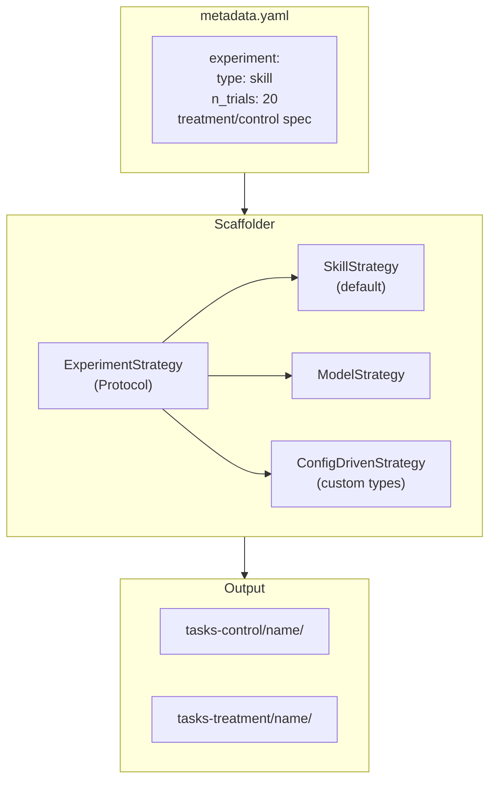

# Generalize Pipeline to Control/Treatment A/B Framework

## Motivation

The pipeline currently hardcodes "skilled vs unskilled" as the only experiment type. This refactor generalizes it to support arbitrary A/B experiments (skills, prompts, models, tools) while keeping skills as the default.

**Terminology:** "control" = baseline (no treatment applied), "treatment" = the intervention being tested. For the current skill experiment: treatment = with skills/docs, control = without.

## Design



## Schema Changes (`abevalflow/schemas.py`)

Add experiment configuration to `SubmissionMetadata`:

```python
class ExperimentType(StrEnum):
    SKILL = "skill"
    MODEL = "model"
    PROMPT = "prompt"
    CUSTOM = "custom"

class CopySpec(BaseModel):
    """A source directory and its destination path inside the container."""
    src: str = Field(description="Directory name in submission (e.g. 'skills')")
    dest: str = Field(description="Absolute path in container (e.g. '/skills')")

    @field_validator("src")
    @classmethod
    def _strip_trailing_slash(cls, v: str) -> str:
        return v.rstrip("/")

    @field_validator("src")
    @classmethod
    def _reject_path_traversal(cls, v: str) -> str:
        if ".." in v or v.startswith("/"):
            raise ValueError("src must be a relative top-level directory name")
        return v

class VariantSpec(BaseModel):
    copy: list[CopySpec] = Field(default_factory=list)
    env_from_secrets: dict[str, str] = Field(
        default_factory=dict,
        description=(
            "Env vars to inject at runtime via OpenShift Secrets. "
            "Keys are env var names, values are secret references "
            "(e.g. 'secret-name/key'). Raw values are NOT allowed."
        ),
    )

    @model_validator(mode="after")
    def _no_duplicate_src(self) -> "VariantSpec":
        srcs = [c.src for c in self.copy]
        if len(srcs) != len(set(srcs)):
            raise ValueError("Duplicate src directories in copy spec")
        return self

class ExperimentConfig(BaseModel):
    type: ExperimentType = Field(
        default=ExperimentType.SKILL,
        description="Experiment type: skill, model, prompt, custom",
    )
    n_trials: int = Field(default=20, gt=0, le=100, description="Number of trials per variant")
    treatment: VariantSpec = Field(
        default_factory=lambda: VariantSpec(
            copy=[CopySpec(src="skills", dest="/skills"), CopySpec(src="docs", dest="/workspace/docs")]
        ),
    )
    control: VariantSpec = Field(default_factory=VariantSpec)
```

Key design decisions:

- **`CopySpec(src, dest)` tuples** instead of plain dir names — `skills/` must copy to `/skills/` (Harbor contract), while `docs/` goes to `/workspace/docs/`. The Dockerfile template uses these pairs directly.
- **`env_from_secrets`** instead of raw `env: dict[str, str]` — prevents secret leakage in metadata.yaml. Values reference OpenShift Secrets (`secret-name/key`), resolved at runtime via `persistent_env` in Harbor, not baked into the Dockerfile.
- **`ExperimentType` is a `StrEnum`** — unknown types raise `ValidationError` at schema validation, not silently falling through.
- **`n_trials`** has an upper bound (`le=100`) to prevent accidental resource exhaustion.
- Bare directory names (no trailing slashes) enforced by `field_validator`.
- Path traversal (`../`, absolute paths) rejected in `src`.
- Duplicate `src` directories rejected by `model_validator`.

## Strategy Pattern (`abevalflow/experiment.py` — new file)

```python
class ExperimentStrategy(Protocol):
    def variant_copy_specs(
        self, submission_dir: Path, variant: str,
    ) -> list[CopySpec]:
        """Return copy specs for this variant (control or treatment)."""

    def customize_context(self, base_context: dict, variant: str) -> dict:
        """Adjust template context per variant.

        Must set 'skills_dir' to '/skills' when skills/ is in the copy
        spec, and omit/None it otherwise. This drives the task.toml.j2
        conditional for skills_dir.
        """

class SkillExperimentStrategy:
    """Default strategy: treatment includes skills/docs, control excludes them.

    customize_context sets:
      - treatment: skills_dir='/skills', copy_pairs=[('skills','/skills'), ...]
      - control:   skills_dir=None,     copy_pairs=[('supportive','/workspace/supportive'), ...]
    """

class ModelExperimentStrategy:
    """Same files for both variants, different env vars.

    Both variants get identical copy specs. The difference is in
    env_from_secrets — e.g., treatment uses model A, control uses model B.
    env vars are injected via Harbor's persistent_env at runtime,
    NOT as Dockerfile ENV directives.
    """

class ConfigDrivenStrategy:
    """Reads copy/env directly from ExperimentConfig for 'custom' type.

    Sets skills_dir='/skills' when 'skills' is in the copy spec src list.
    """
```

Factory function:

```python
_STRATEGY_MAP: dict[ExperimentType, type[ExperimentStrategy]] = {
    ExperimentType.SKILL: SkillExperimentStrategy,
    ExperimentType.MODEL: ModelExperimentStrategy,
    ExperimentType.PROMPT: SkillExperimentStrategy,  # same file logic, different content
    ExperimentType.CUSTOM: ConfigDrivenStrategy,
}

def get_strategy(config: ExperimentConfig) -> ExperimentStrategy:
    cls = _STRATEGY_MAP[config.type]
    return cls(config)
```

No silent fallback — `ExperimentType` enum + dict lookup guarantees a `KeyError` for unmapped types (which can't happen since the enum validates at schema level).

### `skills_dir` contract

The strategy's `customize_context` is responsible for setting `skills_dir` in the template context:

- If `"skills"` is in the variant's copy spec `src` list → set `skills_dir = "/skills"` (or the matching `dest`)
- Otherwise → set `skills_dir = None`

This drives `task.toml.j2`:
```jinja2

skills_dir = "{{ skills_dir }}"

```

## Scaffold Refactor (`scripts/scaffold.py`)

Key changes:
- Replace `SKILLED_COPY_DIRS` / `UNSKILLED_COPY_DIRS` constants with strategy-driven `CopySpec` lists
- Rename output dirs: `tasks/<name>/` → `tasks-treatment/<name>/`, `tasks-no-skills/<name>/` → `tasks-control/<name>/`
- `_build_template_context` populates `copy_pairs` (from `CopySpec`) instead of individual `has_*` booleans
- `scaffold_submission()` returns `(control_dir, treatment_dir)` instead of `(skilled_dir, unskilled_dir)`
- Accept `ExperimentConfig` (from parsed metadata) and delegate to strategy
- Common dirs (`tests/`, `supportive/`, `scripts/`) are always copied for both variants; the strategy only controls the treatment-specific dirs

## Template Unification (`templates/`)

### Merge Dockerfiles into one: `Dockerfile.j2`

Replace `Dockerfile.skilled.j2` and `Dockerfile.unskilled.j2` with a single template:

```jinja2
FROM registry.access.redhat.com/ubi9/python-311:latest

USER 0
RUN dnf install -y --quiet curl \
    && curl -LsSf https://astral.sh/uv/0.9.7/install.sh | env UV_INSTALL_DIR=/usr/local/bin sh \
    && dnf clean all
USER 1001

WORKDIR /workspace

COPY instruction.md .
COPY tests/ /tests/

COPY {{ src }}/ {{ dest }}/

```

`copy_pairs` is a list of `(src, dest)` tuples built from `CopySpec`. Example for skill treatment: `[("skills", "/skills"), ("docs", "/workspace/docs"), ("supportive", "/workspace/supportive")]`. For control: `[("supportive", "/workspace/supportive")]`.

When `copy_pairs` is empty (e.g., control with no optional dirs), no extra `COPY` lines are emitted — the Dockerfile is still valid.

### `task.toml.j2`

Replace `` with ``:

```jinja2

skills_dir = "{{ skills_dir }}"

```

### `test.sh.j2`

No changes needed — `has_llm_judge` is still determined by directory inspection in `_build_template_context`, independent of the experiment strategy.

### Delete `Dockerfile.skilled.j2` and `Dockerfile.unskilled.j2`

## Tekton YAML Renames

### `pipeline/tasks/build-push.yaml`
- Params: `skilled-task-dir` / `unskilled-task-dir` → `treatment-task-dir` / `control-task-dir`
- Results: `skilled-image-ref` / `unskilled-image-ref` → `treatment-image-ref` / `control-image-ref`
- Step names: `build-push-skilled` / `build-push-unskilled` → `build-push-treatment` / `build-push-control`
- Image tags: `:skilled-<sha>` / `:unskilled-<sha>` → `:treatment-<sha>` / `:control-<sha>`

### `pipeline/tasks/scaffold.yaml`
- Results: `skilled-task-dir` / `unskilled-task-dir` → `treatment-task-dir` / `control-task-dir`

### Future `pipeline/tasks/harbor-eval.yaml`
- Will use `treatment-image-ref` / `control-image-ref` and `n-trials` param

### `n_trials` flow (to be investigated)

`n_trials` flows: `metadata.yaml` → scaffold reads it → emits as Tekton result → `harbor-eval.yaml` param → `harbor run` CLI flag.

**Investigation needed:** Verify Harbor's CLI interface for trial count (`--runs`, `--n-trials`, or config-based). If Harbor doesn't support this via CLI, `n_trials` may need to be written into `task.toml` or passed as an environment variable. This investigation should happen before implementing the `harbor-eval.yaml` task.

## Test Updates

### `tests/test_scaffold.py`
- Rename all `skilled`/`unskilled` references to `treatment`/`control`
- Concrete test cases:
  - **Backward compat:** Submission with no `experiment` key produces same output as today (`tasks-treatment/` with skills at `/skills/`, `tasks-control/` without)
  - **Model strategy env:** `ExperimentConfig(type="model", ...)` with `env_from_secrets` populates context correctly for both variants
  - **Custom strategy parity:** `ConfigDrivenStrategy` with `copy=[CopySpec(src="skills", dest="/skills")]` produces identical output to `SkillExperimentStrategy`
  - **Copy path correctness:** Skills copied to `/skills/` (not `/workspace/skills/`), docs to `/workspace/docs/`
  - **Empty copy_pairs:** Control with no optional dirs produces valid Dockerfile (no COPY lines after tests)
  - **n_trials passthrough:** Verify `n_trials` value is accessible after scaffold

### `tests/test_validate.py`
- `ExperimentConfig` validation: valid types, invalid type rejected, `n_trials` bounds
- `VariantSpec` validation: path traversal rejected, duplicate src rejected
- `CopySpec` validation: trailing slash stripped, absolute src rejected
- `env_from_secrets` format validation

## Security Rules

- **NEVER put raw API keys or secrets in `metadata.yaml`** — use `env_from_secrets` which references OpenShift Secret names, not literal values
- `env_from_secrets` values are resolved at runtime via Harbor's `persistent_env` mechanism, injected into trial Pods from cluster Secrets
- `validate.py` should reject `metadata.yaml` files containing common secret patterns (e.g., keys matching `sk-*`, `AKIA*`)

## Backward Compatibility

- If `metadata.yaml` has no `experiment` section, default to `ExperimentConfig()` which produces skill experiment with N=20 — identical to today's behavior
- The `SkillExperimentStrategy` is the default, so existing submissions work without changes
- `examples/sample_skill/metadata.yaml` does NOT need an `experiment` block (defaults apply)
- Add regression test fixture: run scaffold with old-format metadata, assert output matches current behavior

## Commit Plan

| # | Commit | Files |
|---|--------|-------|
| 1 | `feat: add ExperimentConfig, VariantSpec, CopySpec to schema` | `schemas.py`, `test_validate.py` |
| 2 | `feat: add ExperimentStrategy protocol and implementations` | `experiment.py`, `test_experiment.py` (new) |
| 3 | `refactor: scaffold.py — strategy-driven dirs, control/treatment` | `scaffold.py`, `test_scaffold.py` |
| 4 | `refactor: unify Dockerfile templates into Dockerfile.j2` | `Dockerfile.j2` (new), delete `.skilled.j2`/`.unskilled.j2`, `task.toml.j2` |
| 5 | `refactor: rename Tekton params/results to control/treatment` | `build-push.yaml`, `scaffold.yaml` |
| 6 | `docs: update terminology in plan, README, and analysis references` | `implementation_plan.md`, `README.md`, `scripts/analyze.py` |

## Impact on Open PRs

This refactor affects files already in open pull requests. The A/B generalization
should be implemented **after these PRs are merged** to avoid conflict, or as
follow-up commits on the relevant branches.

### PR #1 — `APPENG-4903/phase-1-validation` ([link](https://github.com/RHEcosystemAppEng/ABEvalFlow/pull/1))

**Impact: HIGH** — schema is the foundation of the refactor.

| PR file | A/B plan change |
|---------|-----------------|
| `abevalflow/schemas.py` | Add `ExperimentConfig`, `VariantSpec`, `CopySpec`, `ExperimentType` |
| `tests/test_validate.py` | Add tests for new schema models |
| `scripts/validate.py` | May need to validate `experiment` block if present |

### PR #2 — `APPENG-4903/tekton-triggers-and-validate-task` ([link](https://github.com/RHEcosystemAppEng/ABEvalFlow/pull/2))

**Impact: LOW** — triggers and validate task are experiment-agnostic.

| PR file | A/B plan change |
|---------|-----------------|
| `pipeline/tasks/validate.yaml` | No change needed (validates structure, not experiment type) |
| `pipeline/triggers/*` | No change needed (triggers are submission-agnostic) |
| `Docs/trigger_guide.md` | Minor terminology update (skilled/unskilled references) |
| `examples/sample_skill/metadata.yaml` | No change needed (defaults apply, no `experiment` block required) |

### PR #3 — `APPENG-4904/phase-2-scaffolding` ([link](https://github.com/RHEcosystemAppEng/ABEvalFlow/pull/3))

**Impact: VERY HIGH** — scaffold, templates, and tests are the core of the refactor.

| PR file | A/B plan change |
|---------|-----------------|
| `scripts/scaffold.py` | Major refactor: strategy pattern, `CopySpec`, control/treatment naming |
| `templates/Dockerfile.skilled.j2` | Delete — replaced by unified `Dockerfile.j2` |
| `templates/Dockerfile.unskilled.j2` | Delete — replaced by unified `Dockerfile.j2` |
| `templates/task.toml.j2` | Replace `variant == "skilled"` with `skills_dir` check |
| `templates/test.sh.j2` | No change (verified unaffected) |
| `pipeline/tasks/scaffold.yaml` | Rename results: skilled/unskilled → treatment/control |
| `tests/test_scaffold.py` | Major rename + new experiment config tests |

### Branch `APPENG-4905/phase-3-build-push` (no PR yet)

**Impact: MEDIUM** — param/result/step renames only.

| Branch file | A/B plan change |
|-------------|-----------------|
| `pipeline/tasks/build-push.yaml` | Rename params/results/steps: skilled/unskilled → treatment/control |
| `Docs/implementation_plan.md` | Update terminology in Phases 3-6 |

### Recommended Merge Order

1. Merge PR #1, PR #2, PR #3, and phase-3 branch **as-is** (current skilled/unskilled naming)
2. Create a new branch `APPENG-XXXX/ab-testing-generalization` from `main`
3. Implement the A/B refactor as a single focused effort across all affected files
4. This avoids rebasing conflicts and keeps the current PRs reviewable

Alternative: if PRs are slow to merge, the refactor can be applied directly on PR #3's branch (highest overlap) and the other PRs rebased after.

## Files Changed Summary

| File | Action |
|------|--------|
| `abevalflow/schemas.py` | Add `ExperimentConfig`, `VariantSpec`, `CopySpec`, `ExperimentType` |
| `abevalflow/experiment.py` | New — strategy protocol + `Skill`/`Model`/`ConfigDriven` implementations |
| `scripts/scaffold.py` | Refactor to use strategy, rename control/treatment, use `CopySpec` |
| `scripts/analyze.py` | Rename metric labels from skilled/unskilled to treatment/control |
| `templates/Dockerfile.j2` | New — unified template using `copy_pairs` |
| `templates/Dockerfile.skilled.j2` | Delete |
| `templates/Dockerfile.unskilled.j2` | Delete |
| `templates/task.toml.j2` | Replace `variant == "skilled"` with `skills_dir` check |
| `templates/test.sh.j2` | No changes (verified unaffected) |
| `pipeline/tasks/build-push.yaml` | Rename params/results/steps |
| `pipeline/tasks/scaffold.yaml` | Rename results |
| `tests/test_scaffold.py` | Rename + add experiment config and regression tests |
| `tests/test_validate.py` | Add ExperimentConfig/VariantSpec/CopySpec validation tests |
| `tests/test_experiment.py` | New — strategy unit tests |
| `Docs/implementation_plan.md` | Update terminology (targeted sections: Phase 4.4, 4.6, 5.1, 6) |
| `README.md` | Update terminology |
