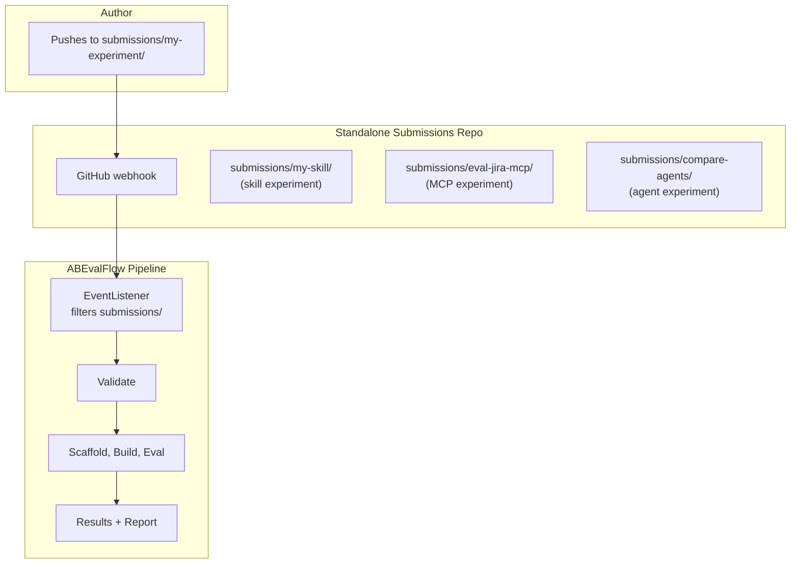
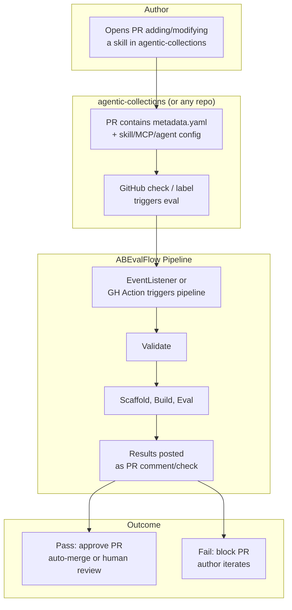

# Trigger Models and Experiment Types

## Trigger Models

### Option 1: Standalone Submissions Repo (Dedicated Eval Queue)

**How it works:**
- A dedicated repo ([`RHEcosystemAppEng/skill-submissions`](https://github.com/RHEcosystemAppEng/skill-submissions)) exists solely for evaluation requests
- Author pushes a folder under `submissions/` with `metadata.yaml` + whatever the experiment needs
- EventListener watches this repo, fires on push
- The submission is ephemeral — it's an evaluation request, not permanent storage
- Results go back to the author (report, PipelineRun status)

**Pros:**
- Clean separation: eval requests don't pollute the skills/collections repo
- Simple trigger: push = evaluate
- Any experiment type works the same way
- Easy to re-run (push again)

**Cons:**
- Separate repo to manage
- No connection to where skills actually live (agentic-collections)
- Results need to be pushed back somewhere useful

### Option 2: PR-Based Trigger on Target Repo (Eval-on-PR)

**How it works:**
- Author opens a PR in `agentic-collections` (or any configured repo) that adds/modifies a skill
- The PR contains a `metadata.yaml` that defines the experiment
- Triggering can be:
  - **Automatic:** GitHub webhook on PR open/update → EventListener fires
  - **Manual:** Reviewer adds a label (e.g., `evaluate`) or comments `/evaluate` → triggers the pipeline
- Results are posted **back to the PR** as a GitHub check or comment
- Pass = PR is approved (or human reviews the report and approves)
- Fail = PR is blocked, author iterates

**Key difference from Option 1:** The evaluation is tied to the PR lifecycle. The submission *is* the PR diff.

**How different experiment types fit:**

| Experiment | PR content | Natural fit? |
|---|---|---|
| **Skill** | New skill folder with SKILL.md + metadata.yaml | Yes — evaluating a contribution |
| **MCP** | metadata.yaml referencing a running MCP service | Somewhat — MCP isn't a "contribution" to the repo |
| **Agent compare** | metadata.yaml with two agent configs | No — no artifact being contributed |
| **Model compare** | metadata.yaml with two model configs | No — no artifact being contributed |

### Comparison

| Aspect | Option 1 (Standalone Repo) | Option 2 (PR-Based) |
|---|---|---|
| **Trigger** | Push to `submissions/` | PR open/label/comment |
| **Best for** | Any experiment type | Skills being contributed to a repo |
| **Results delivery** | PipelineRun status, stored report | PR comment/check, gates merge |
| **Lifecycle** | Fire-and-forget eval request | Tied to PR review cycle |
| **MCP/Agent/Model** | Natural fit | Awkward — no artifact being contributed |
| **Skill eval** | Works but disconnected from where skills live | Natural fit — eval gates the merge |
| **Complexity** | Simpler (one trigger pattern) | More complex (PR events, commit status API, comment posting) |
| **EventListener changes** | Minimal — current design works | Needs PR event filtering, GitHub App/Actions integration |

### Recommendation

**Option 1 is implemented** — [`skill-submissions`](https://github.com/RHEcosystemAppEng/skill-submissions) repo is live with webhook configured, matching the current EventListener design.

**Option 2 can be added later** for the specific case of "skill merged into a target repo needs eval" — this is a CI/CD integration (GitHub Action or webhook on PR) that calls the same pipeline but posts results back to the PR.

The pipeline itself is the same either way — only the trigger and results-delivery differ. The A/B framework handles all experiment types regardless of how they're triggered.

---

## Open Questions

1. **Pass/fail thresholds** — global defaults or configurable per submission?
2. **Notification mechanism** — GitHub checks, Slack, dashboard?
3. **Where do results live permanently?** — PVC, S3/MinIO, committed to a repo?
4. ~~**Submissions repo** — new repo or a `submissions/` folder in agentic-collections?~~ **Resolved:** standalone [`skill-submissions`](https://github.com/RHEcosystemAppEng/skill-submissions) repo.
